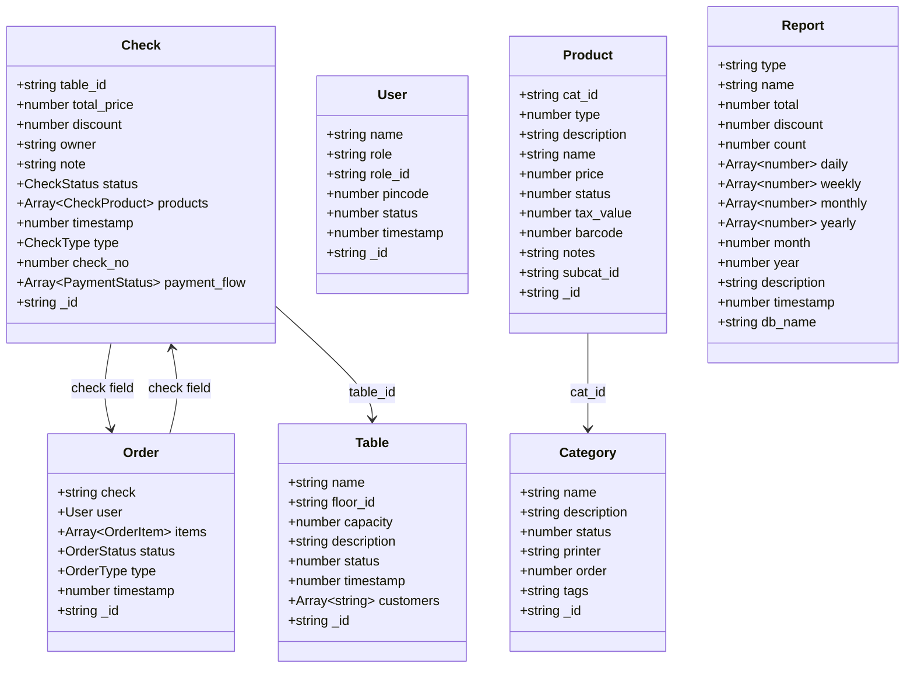
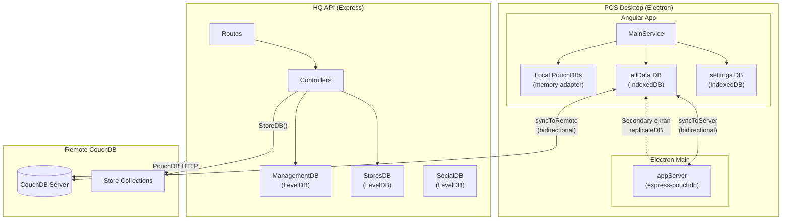
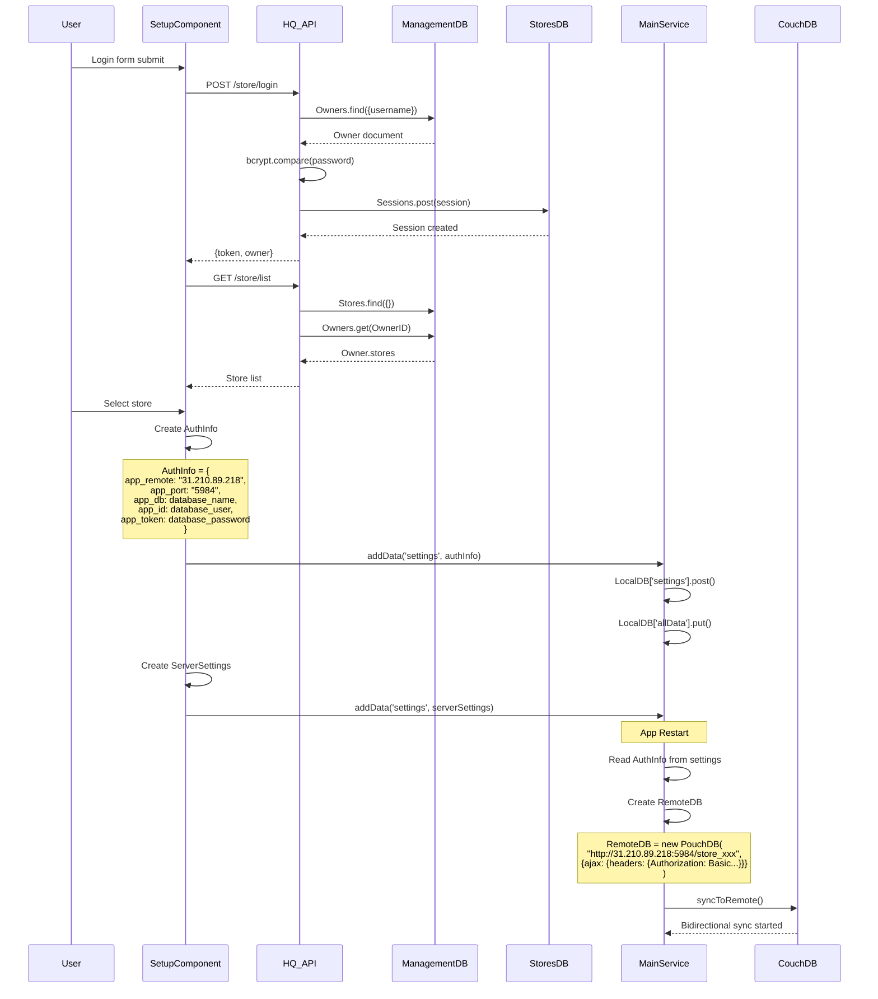
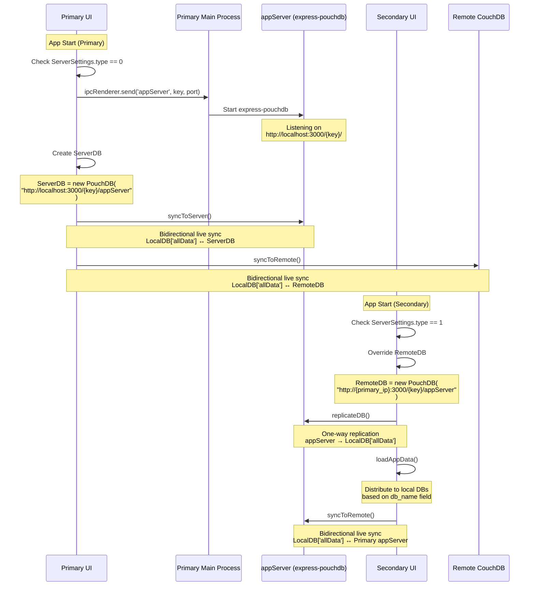

# Quickly POS Ekosistemi - Veritabanı Bağlantı Anatomisi Raporu

## 1) Kısa Özet

Bu rapor, Quickly POS ekosistemindeki iki ana projenin veritabanı bağlantılarını, senkronizasyon mekanizmalarını ve veri akışlarını detaylı olarak analiz etmektedir.

**Temel Bulgular:**
- **POS Desktop (`quickly-desktop/`)**: Angular 5 + Electron uygulaması, PouchDB ile local storage ve CouchDB ile remote sync kullanıyor
- **HQ API (`quickly-hq/`)**: Express.js tabanlı REST API, LevelDB adapter ile local PouchDB ve Nano ile remote CouchDB yönetimi
- **Mimari**: Primary/Secondary ekran desteği ile express-pouchdb üzerinden local HTTP server
- **Sync**: Bidirectional live replication ile offline-first yaklaşım
- **Başka DB Yok**: MongoDB, MySQL, PostgreSQL, Redis, SQLite kullanımı bulunmamaktadır (kod taramasıyla doğrulandı)

---

## 2) DB/Storage Envanteri (Tablo)

### 2.1 POS Desktop - Teknoloji Bağımlılıkları

| Paket | Versiyon | Kullanım | Kanıt |
|-------|----------|----------|-------|
| pouchdb-browser | 9.0.0 | Browser adapter | `package.json:74` |
| pouchdb-adapter-memory | 9.0.0 | Memory adapter | `package.json:73` |
| pouchdb-find | 9.0.0 | Query plugin | `package.json:75` |
| pouchdb-upsert | 2.2.0 | Upsert plugin | `package.json:77` |
| pouchdb-replication-stream | 1.2.9 | Replication stream | `package.json:76` |
| pouch-resolve-conflicts | 1.2.0 | Conflict resolution | `package.json:71` |
| express-pouchdb | 4.2.0 | HTTP server | `package.json:65` |

### 2.2 HQ API - Teknoloji Bağımlılıkları

| Paket | Versiyon | Kullanım | Kanıt |
|-------|----------|----------|-------|
| pouchdb-core | 7.0.0 | Core functionality | `quickly-hq/package.json` |
| pouchdb-adapter-leveldb | 7.1.1 | Local storage (LevelDB) | `quickly-hq/package.json` |
| pouchdb-adapter-http | 7.0.0 | Remote CouchDB | `quickly-hq/package.json` |
| pouchdb-adapter-memory | 7.1.1 | Memory adapter | `quickly-hq/package.json` |
| pouchdb-find | 7.0.0 | Query plugin | `quickly-hq/package.json` |
| pouchdb-replication | 7.2.2 | Replication | `quickly-hq/package.json` |
| pouchdb-upsert | 2.2.0 | Upsert plugin | `quickly-hq/package.json` |
| nano | 9.0.5 | CouchDB admin | `quickly-hq/package.json` |
| express-pouchdb | 4.2.0 | HTTP server | `quickly-hq/package.json` |

---

## 3) Bağlantı Anatomisi

### 3.1 POS Desktop - Local PouchDB Envanteri

**Kaynak:** `src/app/services/main.service.ts:31-61`

```typescript
const db_opts = { revs_limit: 1, auto_compaction: true, adapter: 'memory' };
```

| DB Adı | PouchDB İsmi | Adapter | revs_limit | auto_compaction | Kullanım |
|--------|--------------|---------|------------|-----------------|----------|
| users | local_users | memory | 1 | true | Kullanıcı bilgileri |
| users_group | local_users_group | memory | 1 | true | Kullanıcı grupları |
| checks | local_checks | memory | 1 | true | Açık hesaplar |
| closed_checks | local_closed_checks | memory | 1 | true | Kapatılmış hesaplar |
| credits | local_credits | memory | 1 | true | Krediler |
| customers | local_customers | memory | 1 | true | Müşteriler |
| orders | local_orders | memory | 1 | true | Siparişler |
| receipts | local_receipts | memory | 1 | true | Fişler |
| calls | local_calls | memory | 1 | true | Çağrılar |
| cashbox | local_cashbox | memory | 1 | true | Kasa hareketleri |
| categories | local_categories | memory | 1 | true | Kategoriler |
| sub_categories | local_sub_cats | memory | 1 | true | Alt kategoriler |
| occations | local_occations | memory | 1 | true | Özel durumlar |
| products | local_products | memory | 1 | true | Ürünler |
| recipes | local_recipes | memory | 1 | true | Tarifler |
| floors | local_floors | memory | 1 | true | Katlar |
| tables | local_tables | memory | 1 | true | Masalar |
| stocks | local_stocks | memory | 1 | true | Stoklar |
| stocks_cat | local_stocks_cat | memory | 1 | true | Stok kategorileri |
| endday | local_endday | memory | 1 | true | Gün sonu |
| reports | local_reports | memory | 1 | true | Raporlar |
| logs | local_logs | memory | 1 | true | Loglar |
| commands | local_commands | memory | 1 | true | Komutlar |
| comments | local_comments | memory | 1 | true | Yorumlar |
| prints | local_prints | memory | 1 | true | Yazdırma işleri |
| **settings** | local_settings | **IndexedDB** | **3** | true | Ayarlar |
| **allData** | local_alldata | **IndexedDB** | **3** | **false** | Merkezi sync DB |

**Önemli:** `settings` ve `allData` veritabanları memory adapter kullanmıyor, IndexedDB'ye kalıcı yazılıyor.

### 3.2 POS Desktop - Remote DB Bağlantıları

#### 3.2.1 RemoteDB (CouchDB Bağlantısı)

**Kaynak:** `src/app/services/main.service.ts:63-71`

```typescript
this.getAllBy('settings', { key: 'AuthInfo' }).then(res => {
  if (res.docs.length > 0) {
    this.authInfo = res.docs[0].value;
    this.hostname = 'http://' + this.authInfo.app_remote + ':' + this.authInfo.app_port;
    this.ajax_opts = { ajax: { headers: { Authorization: 'Basic ' + Buffer.from(this.authInfo.app_id + ':' + this.authInfo.app_token).toString('base64') } } };
    this.db_prefix = this.authInfo.app_db;
    this.RemoteDB = new PouchDB(this.hostname + this.db_prefix, this.ajax_opts);
  }
});
```

**URL Şablonu:** `http://{app_remote}:{app_port}/{app_db}`
**Auth:** Basic Auth (Base64 encoded `{app_id}:{app_token}`)

#### 3.2.2 ServerDB (Primary ekran local server)

**Kaynak:** `src/app/services/main.service.ts:85-88`

```typescript
if (this.serverInfo.type == 0) {
  if (this.serverInfo.status == 1) {
    this.ServerDB = new PouchDB(`http://${this.serverInfo.ip_address}:${this.serverInfo.ip_port}/${this.serverInfo.key}/appServer`);
  }
}
```

**URL Şablonu:** `http://{ip_address}:{ip_port}/{key}/appServer`

#### 3.2.3 Secondary RemoteDB Override

**Kaynak:** `src/app/services/main.service.ts:89-91`

```typescript
} else if (this.serverInfo.type == 1) {
  this.RemoteDB = new PouchDB(`http://${this.serverInfo.ip_address}:${this.serverInfo.ip_port}/${this.serverInfo.key}/appServer`);
}
```

Secondary ekranda RemoteDB, Primary'nin local appServer'ına yönlendirilir.

### 3.3 HQ API - Local PouchDB Envanteri

**Kaynak:** `quickly-hq/src/configrations/database.ts:44-109`

```typescript
export const FileSystemConfigration: PouchDB.Configuration.DatabaseConfiguration = { 
  revs_limit: 3, auto_compaction: true, adapter: 'leveldb' 
};
```

#### ManagementDB (Yönetim Veritabanları)

| DB Adı | Path | Model | Kullanım |
|--------|------|-------|----------|
| Users | `{DATABASE_PATH}management/users` | User | Sistem kullanıcıları |
| Groups | `{DATABASE_PATH}management/groups` | Group | Kullanıcı grupları |
| Databases | `{DATABASE_PATH}management/databases` | Database | CouchDB sunucu bilgileri |
| Accounts | `{DATABASE_PATH}management/accounts` | Account | Hesaplar |
| Owners | `{DATABASE_PATH}management/owners` | Owner | İşletme sahipleri |
| Stores | `{DATABASE_PATH}management/stores` | Store | İşletmeler |
| Invoices | `{DATABASE_PATH}management/invoices` | Invoice | Faturalar |
| Companies | `{DATABASE_PATH}management/companies` | Company | Şirketler |
| Suppliers | `{DATABASE_PATH}management/suppliers` | Supplier | Tedarikçiler |
| Producers | `{DATABASE_PATH}management/producers` | Producer | Üreticiler |
| Brands | `{DATABASE_PATH}management/brands` | Brand | Markalar |
| Products | `{DATABASE_PATH}management/products` | Product | Ürünler |
| Categories | `{DATABASE_PATH}management/categories` | Category | Kategoriler |
| SubCategories | `{DATABASE_PATH}management/sub_categories` | SubCategory | Alt kategoriler |
| Campaings | `{DATABASE_PATH}management/campaigns` | Campaign | Kampanyalar |
| Subscriptions | `{DATABASE_PATH}management/subscriptions` | OwnerSubscriptions | Abonelikler |
| Cards | `{DATABASE_PATH}management/cards` | SafeCard | Kartlar |
| Logs | `{DATABASE_PATH}management/logs` | Log | Loglar |
| Sessions | `{DATABASE_PATH}management/sessions` | Session | Oturumlar |
| Aggreements | `{DATABASE_PATH}management/sessions` | AgreementData | Sözleşmeler |

#### StoresDB (İşletme Veritabanları)

| DB Adı | Path | Model |
|--------|------|-------|
| Infos | `{DATABASE_PATH}store/info` | Store |
| Settings | `{DATABASE_PATH}store/settings` | StoreSettings |
| Sessions | `{DATABASE_PATH}store/sessions` | Session |
| Invoices | `{DATABASE_PATH}store/invoices` | Invoice |

#### UtilsDB (Yardımcı Veritabanları)

| DB Adı | Path | Model |
|--------|------|-------|
| Otp | `{DATABASE_PATH}utils/otp` | OtpCheck |
| Sms | `{DATABASE_PATH}utils/sms` | OtpCheck |

#### SocialDB (Sosyal Veritabanları)

| DB Adı | Path |
|--------|------|
| Locations | `{DATABASE_PATH}social/locations` |
| Collections | `{DATABASE_PATH}social/collections` |
| Categories | `{DATABASE_PATH}social/categories` |
| Cuisines | `{DATABASE_PATH}social/cuisines` |
| Stores | `{DATABASE_PATH}social/stores` |
| Tables | `{DATABASE_PATH}social/tables` |
| Products | `{DATABASE_PATH}social/products` |
| Floors | `{DATABASE_PATH}social/floors` |
| Users | `{DATABASE_PATH}social/users` |
| Settings | `{DATABASE_PATH}social/settings` |
| Comments | `{DATABASE_PATH}social/comments` |
| Sessions | `{DATABASE_PATH}social/sessions` |

#### MenuDB

| DB Adı | Path | Adapter |
|--------|------|---------|
| Local | `{DATABASE_PATH}menu/local` | leveldb |
| Memory | `{DATABASE_PATH}menu/memory` | memory (revs_limit: 100) |

### 3.4 HQ API - Remote CouchDB Bağlantıları

#### CouchDB (Nano ile)

**Kaynak:** `quickly-hq/src/configrations/database.ts:111-113`

```typescript
export const CouchDB = (database: Database) => {
    return Nano(`http://${database.username}:${database.password}@${database.host}:${database.port}`);
}
```

**URL Şablonu:** `http://{username}:{password}@{host}:{port}`

#### RemoteDB (PouchDB HTTP adapter)

**Kaynak:** `quickly-hq/src/configrations/database.ts:115-117`

```typescript
export const RemoteDB = (database: Database, collection: string) => {
    return new PouchDB<any>(`http://${database.username}:${database.password}@${database.host}:${database.port}/${collection}`, { adapter: 'http' });
}
```

#### StoreDB (İşletme DB'sine erişim)

**Kaynak:** `quickly-hq/src/configrations/database.ts:119-127`

```typescript
export const StoreDB = async (store_id: any) => {
    try {
        const Store: Store = await ManagementDB.Stores.get(store_id);
        const Database: Database = await ManagementDB.Databases.get(Store.auth.database_id);
        return RemoteDB(Database, Store.auth.database_name);
    } catch (error) {
        throw Error('Store DB Connection Error: ' + error);
    }
}
```

---

## 4) Konfig/ENV + Yerel Ayarlar Haritası

### 4.1 POS Desktop - AuthInfo Yapısı

**Kaynak:** `src/app/mocks/settings.ts:9-17`

```typescript
export class AuthInfo {
    constructor(
        public app_remote: string,   // CouchDB host (örn: "31.210.89.218")
        public app_port: string,     // CouchDB port (örn: "5984")
        public app_db: string,       // Database adı (örn: "/store_xxx")
        public app_id: string,       // Database kullanıcı adı
        public app_token: string,    // Database şifresi
    ) { }
}
```

**Oluşturulduğu yer:** `src/app/components/setup/setup.component.ts:125`

```typescript
let authInfo = new Settings('AuthInfo', new AuthInfo('31.210.89.218', '5984', Data.auth.database_name, Data.auth.database_user, Data.auth.database_password), 'Giriş Bilgileri Oluşturuldu', Date.now());
```

### 4.2 POS Desktop - ServerInfo Yapısı

**Kaynak:** `src/app/mocks/settings.ts:18-26`

```typescript
export class ServerInfo {
    constructor(
        public type: number,        // 0: Primary, 1: Secondary
        public status: number,      // 0: Kapalı, 1: Açık
        public ip_address: string,  // Local IP adresi
        public ip_port: number,     // Port (varsayılan: 3000)
        public key: string          // Token/key (database_id)
    ) { }
}
```

### 4.3 HQ API - Path Sabitleri

**Kaynak:** `quickly-hq/src/configrations/paths.ts:1-8`

```typescript
export const DATABASE_PATH = path.join(__dirname, '../..', '/db/');
export const BACKUP_PATH = path.join(__dirname, '../..', '/backup/');
export const DOCUMENTS_PATH = path.join(__dirname, '../..', '/documents/');
```

**Fiziksel Konum:** `quickly-hq/db/` klasörü

### 4.4 HQ API - Database Model

**Kaynak:** `quickly-hq/src/models/management/database.ts:1-10`

```typescript
export interface Database {
    host: string,        // CouchDB host
    port: string,        // CouchDB port
    username: string,    // Admin kullanıcı adı
    password: string,    // Admin şifresi
    codename: string,    // Tanımlayıcı isim
    timestamp: number,
    _id?: string,
    _rev?: string,
}
```

### 4.5 HQ API - StoreAuth Model

**Kaynak:** `quickly-hq/src/models/management/store.ts:27-32`

```typescript
export interface StoreAuth {
    database_id: string,        // Database kaydının _id'si
    database_name: string,      // CouchDB'deki collection adı
    database_user: string,      // Collection'a erişim kullanıcısı
    database_password: string,  // Collection şifresi
}
```

---

## 5) Sync/Replication Haritası

### 5.1 Sync Noktaları Tablosu

| Konum | Fonksiyon | Kaynak | Hedef | Yön | Live | Retry | Selector |
|-------|-----------|--------|-------|-----|------|-------|----------|
| `main.service.ts:379-388` | syncToServer | LocalDB['allData'] | ServerDB | Bidirectional | ✓ | ✓ | - |
| `main.service.ts:391-405` | syncToRemote | LocalDB['allData'] | RemoteDB | Bidirectional | ✓ | ✓ | - |
| `main.service.ts:369-371` | replicateDB | Primary appServer | LocalDB['allData'] | One-way (to) | ✗ | ✗ | - |
| `main.service.ts:374-375` | replicateFrom | RemoteDB | LocalDB['allData'] | One-way (to) | ✗ | ✗ | - |
| `database.ts:147-157` (HQ) | OrderDB | StoreDatabase | OrderDatabase | Bidirectional | ✓ | ✗ | `db_name: 'orders'/'receipts'` |

### 5.2 syncToServer Detayı

**Kaynak:** `src/app/services/main.service.ts:378-388`

```typescript
syncToServer() {
  return PouchDB.sync(this.LocalDB['allData'], this.ServerDB, {
    live: true, 
    retry: true, 
    heartbeat: 2500, 
    back_off_function: (delay) => {
      delay = 1000;
      return delay;
    }
  })
  .on('change', (sync) => { this.handleChanges(sync) })
}
```

**Özellikler:**
- **live:** true - Sürekli dinleme
- **retry:** true - Bağlantı koptuğunda yeniden dene
- **heartbeat:** 2500ms
- **back_off:** Sabit 1000ms

### 5.3 syncToRemote Detayı

**Kaynak:** `src/app/services/main.service.ts:391-405`

```typescript
syncToRemote() {
  let rOpts: PouchDB.Replication.ReplicateOptions = { live: true, retry: true };
  if (this.serverInfo.type == 1) {  // Secondary ekran
    rOpts = {
      live: true, retry: true, heartbeat: 2500, back_off_function: (delay) => {
        delay = 1000;
        return delay;
      }
    };
  }
  return PouchDB.sync(this.LocalDB['allData'], this.RemoteDB, rOpts)
    .on('change', (sync) => { this.handleChanges(sync) })
}
```

### 5.4 handleChanges - Pull Sonrası Dağıtım

**Kaynak:** `src/app/services/main.service.ts:271-298`

```typescript
handleChanges(sync) {
  const changes = sync.change.docs;
  if (sync.direction === 'pull') {
    changes.forEach((element) => {
      if (!element._deleted) {
        let db = element.db_name;  // Dokümanın ait olduğu local DB
        if (element.key !== 'ServerSettings' || element.key !== 'ActivationStatus') {
          delete element._rev;
          delete element._revisions;
          delete element.db_seq;
          delete element.db_name;
          this.LocalDB[db].upsert(element._id, (doc) => {
            return Object.assign(doc, element);
          });
        }
      } else {
        // Silinen dokümanı tüm local DB'lerden kaldır
        for (let db in this.LocalDB) {
          if (db !== 'allData') {
            this.LocalDB[db].get(element._id).then((doc) => {
              if (doc) return this.LocalDB[db].remove(doc);
            });
          }
        }
      }
    });
  }
}
```

**Mantık:** `allData` DB'sine gelen değişiklikler, `db_name` alanına göre ilgili local DB'ye dağıtılır.

### 5.5 Changes Feed Kullanımları

| Dosya | Satır | DB | Amaç |
|-------|-------|-----|------|
| `app.component.ts` | 229 | orders | Sipariş yazdırma |
| `app.component.ts` | 325 | commands | Komut çalıştırma |
| `app.component.ts` | 351 | endday | Gün sonu işlemi |
| `app.component.ts` | 371 | settings | Ayar değişikliği |
| `app.component.ts` | 382 | prints | Yazdırma işleri |
| `main.service.ts` | 253 | [parametrik] | Local sync before remote |
| `order.service.ts` | 13 | orders | Sipariş dinleyici |
| `selling-screen.component.ts` | 155 | checks | Hesap değişiklikleri |
| `store.component.ts` | 71,80,87,94 | checks,orders,receipts,tables | UI güncellemeleri |
| `payment-screen.component.ts` | 81 | checks | Ödeme ekranı |

---

## 6) REST API → DB Haritası

### 6.1 POS'un Kullandığı Endpoint'ler

**Base URL:** `https://hq.quickly.com.tr` (Kaynak: `src/app/services/http.service.ts:18`)

| Endpoint | Method | Kullanım Yeri | Açıklama |
|----------|--------|---------------|----------|
| `/store/login` | POST | `setup.component.ts:95` | Giriş yapma |
| `/store/list` | GET | `setup.component.ts:98` | İşletme listesi |

**Header'lar:**
```typescript
// setup.component.ts:32-33
this.headers = new Headers({ 'Content-Type': 'application/json', 'charset': 'UTF-8' });
// Login sonrası:
this.headers.append('Authorization', res.json().token);
```

**http.service.ts Header'ları:**
```typescript
// http.service.ts:27-30
private _createAuthorizationHeader(headers: Headers, token?: string) {
  headers.set('Authorization', token);
  headers.set('Store', this.store_id);
}
```

### 6.2 HQ Route → Controller → DB Zinciri

#### POST /store/login

**Route:** `quickly-hq/src/routes/store.ts:33-36`
```typescript
router.post("/login", SchemaGuard(AuthSchemaSafe), StoreAuthController.Login);
```

**Controller:** `quickly-hq/src/controllers/store/authentication.ts:13-57`

**DB Operasyonları:**
1. `ManagementDB.Owners.find({ selector: { username: formData.username } })` - Kullanıcı bulma
2. `StoresDB.Sessions.find({ selector: { user_id: session.user_id } })` - Mevcut oturum kontrolü
3. `StoresDB.Sessions.put(session)` veya `StoresDB.Sessions.post(session)` - Oturum oluşturma/güncelleme

#### GET /store/list

**Route:** `quickly-hq/src/routes/store.ts:116-119`
```typescript
router.get("/list", StoreAuthenticateGuard, ListController.listStores);
```

**Controller:** `quickly-hq/src/controllers/store/general.ts:13-26`

**DB Operasyonları:**
1. `ManagementDB.Stores.find({ selector: {}, limit: DatabaseQueryLimit, skip: 0 })` - Tüm işletmeler
2. `ManagementDB.Owners.get(OwnerID)` - Sahip bilgisi
3. Filtreleme: `Stores.filter(store => Owner.stores.includes(store._id))`

#### GET /store/info

**Route:** `quickly-hq/src/routes/store.ts:120-125`
```typescript
router.get("/info", StoreAuthenticateGuard, StoreGuard, AccountGuard, ListController.storeInfo);
```

**Controller:** `quickly-hq/src/controllers/store/general.ts:28-52`

**DB Operasyonları:**
1. `StoreDB(StoreID)` - Remote store DB bağlantısı
2. `StoreDatabase.find({ selector: { db_name: 'tables' } })` - Masalar
3. `StoreDatabase.find({ selector: { db_name: 'cashbox' } })` - Kasa
4. `StoreDatabase.find({ selector: { db_name: 'checks' } })` - Hesaplar
5. `StoreDatabase.find({ selector: { db_name: 'closed_checks' } })` - Kapalı hesaplar
6. `StoreDatabase.find({ selector: { db_name: 'orders' } })` - Siparişler
7. `StoreDatabase.find({ selector: { db_name: 'receipts' } })` - Fişler

---

## 7) Doküman Şemaları, Index'ler, İlişkiler

### 7.1 db_name Sözlüğü

| db_name Değeri | POS Local DB | Kullanım Alanı | HQ Erişim |
|----------------|--------------|----------------|-----------|
| users | LocalDB['users'] | Kullanıcı yönetimi | - |
| users_group | LocalDB['users_group'] | Yetki grupları | - |
| checks | LocalDB['checks'] | Açık hesaplar | StoreDB query |
| closed_checks | LocalDB['closed_checks'] | Kapalı hesaplar | StoreDB query |
| credits | LocalDB['credits'] | Krediler | - |
| customers | LocalDB['customers'] | Müşteriler | - |
| orders | LocalDB['orders'] | Siparişler | StoreDB query |
| receipts | LocalDB['receipts'] | Fişler | StoreDB query |
| calls | LocalDB['calls'] | Çağrılar | - |
| cashbox | LocalDB['cashbox'] | Kasa hareketleri | StoreDB query |
| categories | LocalDB['categories'] | Kategoriler | - |
| sub_categories | LocalDB['sub_categories'] | Alt kategoriler | - |
| occations | LocalDB['occations'] | Özel durumlar | - |
| products | LocalDB['products'] | Ürünler | - |
| recipes | LocalDB['recipes'] | Tarifler | - |
| floors | LocalDB['floors'] | Katlar | - |
| tables | LocalDB['tables'] | Masalar | StoreDB query |
| stocks | LocalDB['stocks'] | Stoklar | - |
| stocks_cat | LocalDB['stocks_cat'] | Stok kategorileri | - |
| endday | LocalDB['endday'] | Gün sonu sinyali | - |
| reports | LocalDB['reports'] | Raporlar | - |
| logs | LocalDB['logs'] | Loglar | - |
| commands | LocalDB['commands'] | Komutlar | - |
| comments | LocalDB['comments'] | Yorumlar | - |
| prints | LocalDB['prints'] | Yazdırma işleri | - |
| settings | LocalDB['settings'] | Ayarlar | - |

### 7.2 Index'ler

#### POS Desktop

**Kaynak:** `src/app/services/main.service.ts:185-191`

```typescript
createIndex(db: string, fields: Array<string>): Promise<any> {
  return this.LocalDB[db].createIndex({
    index: {
      fields: fields
    }
  });
}
```

**Not:** Kod taramasında `createIndex` çağrısı bulunamadı - index'ler runtime'da oluşturulmuyor.

#### HQ API

**Kaynak:** `quickly-hq/src/functions/management/database.ts:7`

```typescript
export const createIndexesForDatabase = (Database: PouchDB.Database, indexObj: PouchDB.Find.CreateIndexOptions) => Database.createIndex(indexObj);
```

**Kullanım:** `quickly-hq/src/configrations/database.ts:140-144`

```typescript
createIndexesForDatabase(Database, { index: { fields: ['db_name','check'] } }).then(res => {
    console.log('Indexing Finished Succesfully For Order Database');
});
```

**Index'lenen Alanlar:** `db_name`, `check`

### 7.3 Doküman Şemaları (Mermaid)



---

## 8) Operasyonel Davranışlar

### 8.1 Conflict Resolution

**Kaynak:** `src/app/services/conflict.service.ts`

**Çalışma Mekanizması:**
1. `conflictListener()` her 60 saniyede bir çalışır (satır 10)
2. `ServerDB.allDocs({ include_docs: true, conflicts: true, revs: true })` ile conflict'li dokümanlar bulunur
3. Her conflict için `getPreRevision()` ile önceki revizyon alınır
4. `diffResolver()` ile çözüm uygulanır

**Özel Merge Mantığı (reports için):**

**Kaynak:** `src/app/services/conflict.service.ts:44-91`

```typescript
if (older_document.db_name == 'reports') {
  const aDiff = this.diffReduce(a, older_document);
  const bDiff = this.diffReduce(b, older_document);
  // Sayısal alanlar için fark hesaplanıp toplanır
  aDiff.forEach(diff => {
    resolvedDoc[diff.firsProp] += Math.abs(olderACopy[diff.firsProp] - diff.data)
  });
}
```

**Diğer Dokümanlar için:**
- Timestamp karşılaştırması yapılır
- Daha yeni olan kazanır
- Eşitse revision numarası karşılaştırılır

### 8.2 Retry/Backoff Ayarları

| Parametre | Değer | Kaynak |
|-----------|-------|--------|
| heartbeat | 2500ms | `main.service.ts:380` |
| back_off | 1000ms (sabit) | `main.service.ts:381-383` |
| batch_size | 500 | `main.service.ts:371` |
| batches_limit | 50 | `main.service.ts:371` |
| timeout | 60000ms | `main.service.ts:371` |

### 8.3 Limits

| Parametre | Değer | Kaynak |
|-----------|-------|--------|
| DatabaseQueryLimit (HQ) | 2500 | `database.ts:42` |
| find limit (POS) | 10000 | `main.service.ts:103` |

---

## 9) Diyagramlar

### 9.1 Bileşenler → DB'ler → Sync Yönleri



### 9.2 POS Kurulum/Login → Credential → CouchDB Sync



### 9.3 Primary ↔ Secondary (appServer) → Replication/Sync



---

## 10) Bilinmeyenler + Doğrulama Adımları

### 10.1 Bilinmeyenler

| # | Konu | Açıklama | Doğrulama Adımı |
|---|------|----------|-----------------|
| 1 | Production CouchDB Host | Kodda hardcoded "31.210.89.218" var ama production'da farklı olabilir | HQ API'nin Database collection'ını kontrol et |
| 2 | SSL/TLS | CouchDB bağlantısı HTTP üzerinden, HTTPS kullanılıyor mu? | Network trafiğini izle veya reverse proxy config'i kontrol et |
| 3 | Reverse Proxy | HQ API'nin önünde nginx/apache var mı? | Server config dosyalarını kontrol et |
| 4 | Backup Mekanizması | `loadFromBackup()` fonksiyonu `./data/db.dat` dosyasını okuyor ama bu dosya nasıl oluşturuluyor? | Backup oluşturma kodunu ara |
| 5 | ENV Değişkenleri | HQ API'de `.env` dosyası yok, tüm config hardcoded | Production deployment'ı kontrol et |
| 6 | CouchDB Versiyonu | Hangi CouchDB versiyonu kullanılıyor? | CouchDB sunucusuna bağlanıp `/_` endpoint'ini kontrol et |
| 7 | Memory Adapter Limitleri | Memory adapter'da veri boyutu limiti var mı? | PouchDB dokümantasyonunu kontrol et |

### 10.2 Potansiyel Sorunlar

1. **Memory Adapter Riski:** Tüm local DB'ler memory adapter kullanıyor, uygulama kapanınca veri kaybı olabilir (sadece `allData` ve `settings` kalıcı)

2. **Hardcoded IP:** `setup.component.ts:125`'te CouchDB IP'si hardcoded

3. **Secret Exposure:** AuthInfo içindeki `app_token` (database password) local storage'da plaintext saklanıyor

---

## 11) Tamamlama Kriterleri (Checklist)

- [x] `quickly-desktop` + `quickly-hq` DB bağımlılıkları listelendi ve kodla doğrulandı
- [x] POS'ta tüm local PouchDB DB adları + adapter ayarları + yaşam döngüsü çıkarıldı
- [x] POS'ta Remote CouchDB URL/auth üretimi (AuthInfo alanları) kanıtlı haritalandı
- [x] Primary/Secondary appServer mimarisi (IPC → express-pouchdb mount → istemci URL şablonu) kanıtlı çıkarıldı
- [x] Tüm sync/replication noktaları (iki repo) bulundu; yön/ayar/selector detayları yazıldı
- [x] Conflict çözümü (nerede, hangi DB'de, hangi dokümanlarda) açıklandı
- [x] POS'un tüm REST endpoint kullanımları listelendi ve HQ tarafında route/controller/DB zinciri kuruldu
- [x] HQ local DB path'leri ve remote CouchDB bağlantı mantığı (Nano/RemoteDB/StoreDB) çıkarıldı
- [x] Doküman şemaları + `db_name` sözlüğü + index'ler çıkarıldı; Mermaid diyagramları eklendi
- [x] Çıktıda hiçbir secret değeri yok (sadece isim/alan)
- [x] Bilinmeyenler açıkça işaretlendi ve doğrulama adımı eklendi

---

## 12) Kapsam Özeti (Anahtar Kelime Taraması)

| Anahtar Kelime | Eşleşme Sayısı | Kapsandığı Bölüm |
|----------------|----------------|------------------|
| `new PouchDB` | 50+ | Bölüm 3.1, 3.3 |
| `PouchDB.sync` | 2 | Bölüm 5.1, 5.2, 5.3 |
| `.replicate.` | 4 | Bölüm 5.1 |
| `.changes(` | 15 | Bölüm 5.5 |
| `express-pouchdb` | 2 | Bölüm 3.2.2 |
| `Nano(` | 1 | Bölüm 3.4 |
| `_users` | 3 | Bölüm 3.4 |
| `_security` | 3 | Bölüm 3.4 |
| `Authorization` | 5+ | Bölüm 3.2.1, 6.1 |
| `/store/login` | 2 | Bölüm 6.1, 6.2 |
| `/store/list` | 2 | Bölüm 6.1, 6.2 |
| `db_name` | 30+ | Bölüm 7.1 |
| `ServerSettings` | 10+ | Bölüm 4.2 |
| `AuthInfo` | 10+ | Bölüm 4.1 |
| `appServer` | 6 | Bölüm 3.2.2 |

---


## 13)_all_docss.json ER diyagramı (normalize bakış + ilişkiler)

Bu veri modeli (_all_docss.json) CouchDB/PouchDB doküman tabanlı olsa da, operasyonel ilişkiler net. Aşağıdaki ER diyagramı uygulama seviyesinde kurgulanan ilişkileri gösterir (özellikle order.check, items.product_id, closed_checks.table_id gibi alanlardan).


erDiagram
  USERS ||--o{ ORDERS : "creates (orders.user)"
  CHECKS ||--o{ ORDERS : "contains (orders.check)"
  TABLES ||--o{ CHECKS : "opened_on (checks.table_id) [varsayım]"
  PRODUCTS ||--o{ ORDER_ITEMS : "referenced_by (items.product_id)"
  ORDERS ||--o{ ORDER_ITEMS : "has (orders.items[])"

  USERS ||--o{ ENDDAY : "owner (endday.owner)"
  TABLES ||--o{ CLOSED_CHECKS : "closed_for (closed_checks.table_id)"
  USERS ||--o{ CLOSED_CHECKS : "owner (closed_checks.owner)"
  PRODUCTS ||--o{ CLOSED_CHECK_PRODUCTS : "sold_as (closed_checks.products[])"

  SETTINGS ||--|| STORE_CONFIG : "key-value"
  REPORTS ||--|| KPI_SERIES : "time_series/aggregates"

  USERS {
    string _id
    string name
    string role
    string role_id
    int    pincode
    int    status
    number timestamp
  }

  CHECKS {
    string _id
    string table_id
    int    status
    number timestamp
    string db_name
  }

  TABLES {
    string _id
    string name
    int    status
    string db_name
  }

  ORDERS {
    string _id
    string check
    object user
    int    status
    int    type
    number timestamp
    bool   edited
    string db_name
  }

  ORDER_ITEMS {
    string product_id
    string name
    number price
    string note
  }

  PRODUCTS {
    string _id
    string cat_id
    string name
    number price
    int    status
    number tax_value
    string barcode
    array  specifies
    array  extras
    string db_name
  }

  ENDDAY {
    string _id
    string owner
    number total_income
    number cash_total
    number card_total
    number discount_total
    int    check_count
    object customers
    string data_file
    bool   is_synchronized
    string db_name
  }

  CLOSED_CHECKS {
    string _id
    string table_id
    string owner
    array  products
    number total_price
    string payment_method
    string payment_flow
    number discount
    string occupation
    string note
    int    status
    number timestamp
    int    type
    string db_name
  }

  SETTINGS {
    string _id
    string key
    object value
    string description
    number timestamp
    string db_name
  }

  LOGS {
    string _id
    int    type
    string user
    string connection_id
    string description
    int    status
    number timestamp
    string db_name
  }

  REPORTS {
    string _id
    string type
    string name
    array  activity
    array  activity_time
    array  activity_count
    number timestamp
    string db_name
  }


*Rapor Tarihi: 2025-12-28*
*Analiz Edilen Commit: 2cc5f02*
